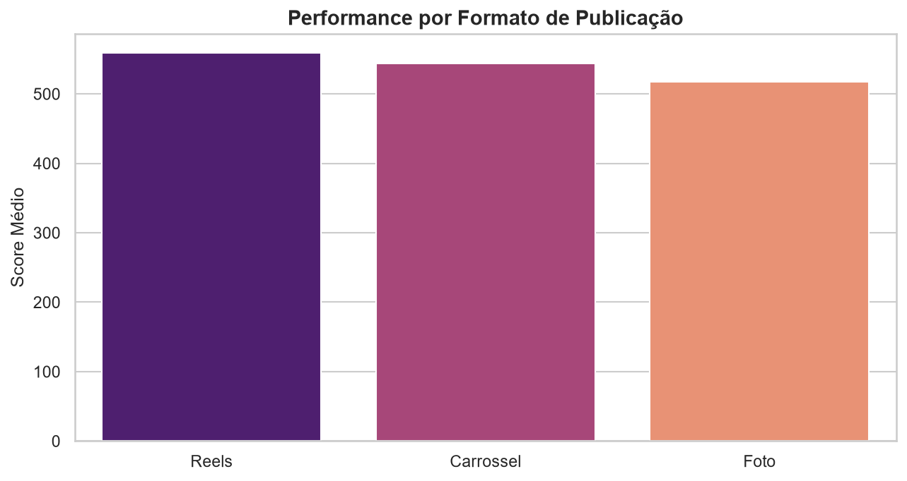
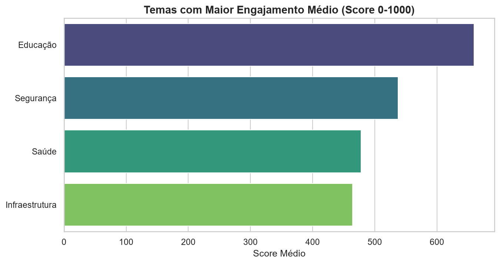
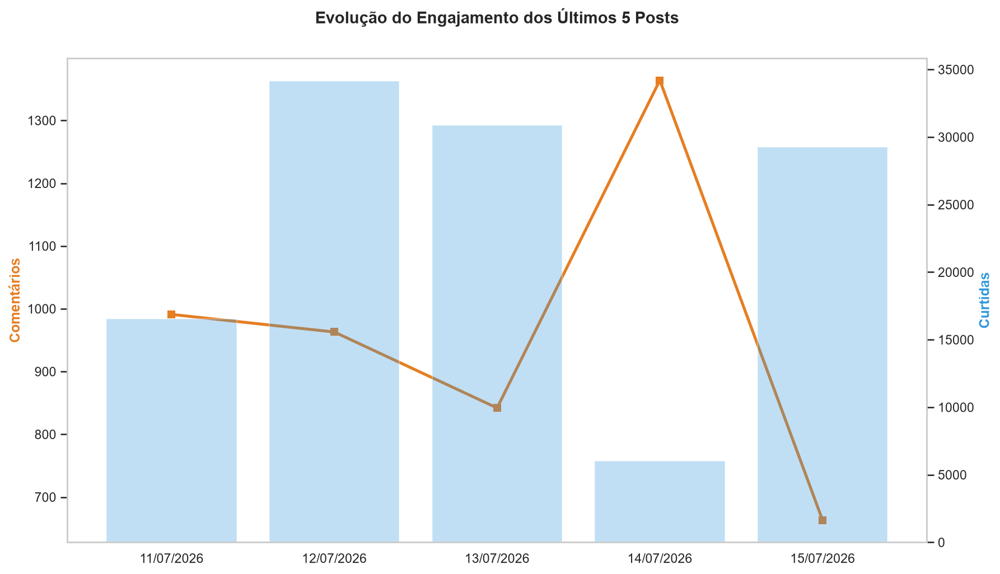

# 📊 RELATÓRIO DE INTELIGÊNCIA: GOVERNO DO ESTADO DE SÃO PAULO

## 🚀 TRAÇÃO E CRESCIMENTO (KPIs)
Abaixo acompanhamos os indicadores de aceleração e saúde da base.
* 👥 **Crescimento da Base de Seguidores (Growth Rate):** +2.4% *(O aumento no engajamento total deve ser interpretado em conjunto com o crescimento orgânico da base de audiência)*.

**Métricas dos Últimos 15 Dias:**
* 📝 **Total de Postagens:** 15 posts
* ❤️ **Volume de Curtidas:** 308,199 
* 💬 **Volume de Comentários:** 13,057
* 🎯 **Score Quinzenal Acumulado:** 438,769 pts
* 🟢 **Evolução Quinzenal:** +8.7% *(vs 15 dias anteriores)*

**Crescimento de Médio Prazo:**
* 🟢 **Month-over-Month (MoM):** +12.2% *(vs 30 dias anteriores)*

---

## ⚡ EFICIÊNCIA E VIRALIZAÇÃO
Entendendo a qualidade da entrega do algoritmo e a profundidade da interação da base:
* **Taxa Média de Engajamento por Alcance:** 14.5% *(Proporção do público que visualizou e interagiu)*.
* **Proporção Comentário/Curtida:** 6.0% *(Mede a profundidade: alto volume indica debates e mobilização orgânica, baixo volume sugere interação superficial)*.
* **Velocidade Média de Engajamento:** 6.3 horas *(Tempo médio para atingir 50% do engajamento total)*.

### Desempenho por Formato e Tema
Qual tipo de entrega gera mais conversão para o nosso canal? O algoritmo do Instagram privilegia diferentes formatos de acordo com o comportamento do público.

---

## 📈 EVOLUÇÃO TEMPORAL (ÚLTIMOS POSTS)
Este gráfico mapeia a resposta da audiência em publicações recentes. Picos identificam pautas com grande fit e mobilização. As colunas representam o volume de curtidas e as linhas representam o fluxo de comentários.
* **Média de Curtidas no período (últimos 5):** 23,356
* **Média de Comentários no período (últimos 5):** 965

### 📊 Detalhamento de Performance
Abaixo está a quebra analítica de cada um dos últimos posts. A URL serve como link direto para auditar a publicação em caso de picos (positivos ou negativos).
| URL | Tema | Mídia | Curtidas | Comentários | Eng. Rate | Score |
|:---|:---|:---|:---|:---|:---|:---|
| [post_55](https://www.instagram.com/p/id_55/) | Saúde | Reels | 16,534 | 991 | 10.4% | 539 |
| [post_56](https://www.instagram.com/p/id_56/) | Segurança | Reels | 34,127 | 963 | 65.3% | 893 |
| [post_57](https://www.instagram.com/p/id_57/) | Educação | Foto | 30,851 | 842 | 11.4% | 801 |
| [post_58](https://www.instagram.com/p/id_58/) | Educação | Foto | 6,016 | 1,364 | 2.6% | 401 |
| [post_59](https://www.instagram.com/p/id_59/) | Educação | Foto | 29,253 | 663 | 47.1% | 732 |

---

## 💬 MÉTRICAS QUALITATIVAS (SENTIÊNCIA E PAUTAS)
Mapeamento do humor da rede e concentração de conversas.
* **Net Sentiment Score (NSS):** +20.4% *(Índice de humor líquido: Positivos - Negativos. Indica a tendência central da imagem digital)*.
* **Volume de Menções em Temas Críticos vs. Propositivos:** Historicamente, 21.7% das menções ocorrem em contextos críticos (cobranças e crises) e 78.3% em contextos propositivos.

🏁 *Fim do relatório de inteligência.*
