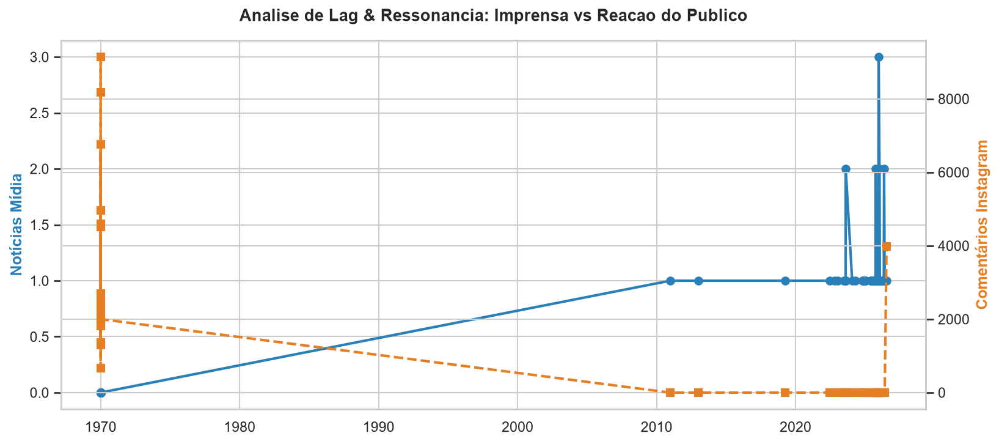

# RELATÓRIO EXECUTIVO DE INTELIGÊNCIA DIGITAL & SENTIMENTO PÚBLICO
**CLIENTE:** GOVERNO DO ESTADO DE SÃO PAULO | **MÓDULO:** AUDITORIA DE REDES SOCIAIS & IMPRENSA

---

## METADADOS DA AUDITORIA TEMPORAL
* **Período Total do Estudo:** 04/07/2026 a 21/07/2026 (16 dias auditados)
* **Ponto Focal de Referência (Data de Corte):** 21/07/2026 11:08
* **Amostragem Mapeada:** 30 publicações oficiais do feed/Reels
* **Volume Absoluto de Audiência:** 50,227,623 visualizações auditadas
* **Volume de Interações Diretas:** 2,127,177 ações registradas
* **Total de Comentários Auditados via IA:** 364 comentários processados pelo modelo BERT

---

## GUIA METODOLÓGICO: COMO LER ESTES INDICADORES

Esta auditoria utiliza métricas avançadas de Data Science para transformar dados brutos de redes sociais em decisões estratégicas de comunicação pública:

1. **Score Ponderado de Engajamento (0 a 1000):** Indicador central do estudo. Aplica peso **10x superior** ao comentário devido ao esforço ativo do usuário:
   $$\text{Raw Score} = \text{Curtidas} + (\text{Comentários} \times 10)$$
2. **Virality Index (Taxa de Retenção do Reels):** Calculado por $(\text{Curtidas} / \text{Visualizações}) \times 100$. Indica a capacidade do vídeo de converter espectadores em apoiadores.
3. **Net Sentiment Score (NSS):** Saldo líquido da reputação digital:
   $$\text{NSS} = \frac{\text{Comentários Positivos} - \text{Comentários Negativos}}{\text{Total de Comentários Auditados}} \times 100$$
4. **Controversy Score (Índice de Controvérsia):** Mede o grau de atrito de uma pauta. Calculado por $\frac{\text{Críticas}}{\text{Elogios} + 1}$. Valores acima de **1.0** sinalizam pautas que dividem a opinião pública.

---

## 1. PANORAMA EXECUTIVO & COMPARAÇÃO TEMPORAL (KPIS CONSOLIDADOS)

### Visão Geral do Período Histórico Acumulado (16 dias auditados)
* **Volume Total de Publicações:** **30 posts**
* **Frequência Média de Postagem:** **1.9 posts/dia**
* **Volume Total de Curtidas:** **2,064,254**
* **Volume Total de Comentários:** **62,923**
* **Alcance Bruto em Vídeo:** **50,227,623 reproduções**
* **Score de Engajamento Acumulado Total:** **2,693,484 pts**
* **Concentração de Impacto (Pareto 80/20):** **48.0%** *(engajamento vindo dos top 20% melhores posts)*

### Comparativo da Última Quinzena (Últimos 15 Dias)
* **Total de Publicações (15d):** **28 posts**
* **Volume de Curtidas (15d):** **1,761,829**
* **Volume de Comentários (15d):** **51,939**
* **Visualizações de Vídeo (15d):** **43,891,702**
* **Score Quinzenal Acumulado:** **2,281,219 pts** *(vs 412,265 pts da quinzena anterior)*
* **Crescimento Quinzenal:** **+453.3%** *(aceleração nos últimos 15 dias)* [Crescimento Acelerado]

### Crescimento de Médio Prazo (Month-over-Month - 30d)
* **Score Mensal Atual (Últimos 30d):** **2,693,484 pts**
* **Score Mensal Anterior (30d Anteriores):** **0 pts**
* **Growth Month-over-Month (MoM):** **+0.0%** *(variação percentual de crescimento mensal)* [Estavel]

---

## 2. MATRIZ BCG DE PAUTAS POLÍTICAS & RETENÇÃO DE VÍDEO

Análise combinada de volume de postagens vs. aprovação popular do tema:

* **Taxa Média de Engajamento por Alcance:** **4.1%**
* **Virality Index Médio (Likes/Views):** **4.0%**
* **Índice de Provocação de Debate (Comentários/Curtidas):** **2.9%**

---

## 3. ANÁLISE TEMPORAL E JANELA ÓTIMA DE PUBLICAÇÃO

* **Dia de Ouro:** **Sexta** *(dia com maior taxa de resposta do algoritmo)*
* **Horário de Ouro:** **20:00h** *(janela de pico de engajamento popular)*

---

## 4. ANÁLISE QUALITATIVA DE SENTIMENTO, POLARIZAÇÃO & AUDIÊNCIA (IA / BERT)

* **Net Sentiment Score (NSS):** **+55.2%**
* **Controversy Score (Taxa de Polarização):** **0.21** *(Valores > 1.0 indicam pautas sensíveis/atrito)*
* **Sentimento Positivo:** 254 comentários (69.8% do total)
* **Sentimento Neutro:** 57 comentários (15.7% do total)
* **Sentimento Negativo:** 53 comentários (14.6% do total)

### Mapeamento de Usuários Super-Engajados (Militância / Base Ativa)
| Usuário | Qtd. Comentários Deixados no Período |
|:---|:---|
| @larissa_andrade_rosa | **7 comentários** |
| @enhancingdrug | **3 comentários** |
| @ianfabiano | **3 comentários** |
| @mariastelapereirafi | **2 comentários** |
| @brunofroesoliveira | **2 comentários** |

### ANÁLISE SEMÂNTICA EM TRÊS NÍVEIS (NUVENS DE PALAVRAS)

#### 1. Nuvem Geral da População
Visão holística de todos os termos com maior repetição nos comentários:

#### 2. Nuvem Positiva (Pontos Fortes & Validação)
Termos associados a elogios, apoio político e reconhecimento das ações de governo:

#### 3. Nuvem Negativa (Matriz de Riscos & Críticas)
Isolamento das dores da população, cobranças por serviços públicos e pautas sensíveis:

---

## 5. ANÁLISE DE LAG & RESSONÂNCIA (IMPRENSA vs. POPULAÇÃO)

Análise do tempo de resposta (*Lag*) entre a cobertura de notícias na imprensa e a reação do eleitorado nas redes sociais:

---

## 6. AUDITORIA DE CONTEÚDO: DESTAQUES x ALERTAS

### TOP 3 PUBLICAÇÕES DE MAIOR IMPACTO (BEST PRACTICES)
| Post Shortcode | Pauta Temática | Formato | Curtidas | Comentários | Score (0-1000) |
|:---|:---|:---|:---|:---|:---|
| [DaoF32rx1Jw](https://www.instagram.com/p/DaoF32rx1Jw/) | Segurança Pública | Video | 264,007 | 5,626 | **1000** |
| [DaaI1CPRDzE](https://www.instagram.com/p/DaaI1CPRDzE/) | Institucional / Comunicação Geral | Video | 213,652 | 9,142 | **952** |
| [Dacze0TRyGw](https://www.instagram.com/p/Dacze0TRyGw/) | Saneamento & Meio Ambiente | Video | 124,310 | 7,201 | **612** |

### BOTTOM 3 PUBLICAÇÕES DE MENOR RESSONÂNCIA (PONTOS DE ATENÇÃO)
| Post Shortcode | Pauta Temática | Formato | Curtidas | Comentários | Score (0-1000) |
|:---|:---|:---|:---|:---|:---|
| [DasPImoR6I-](https://www.instagram.com/p/DasPImoR6I-/) | Segurança Pública | Video | 7,752 | 412 | **37** |
| [DatP0fZxZiM](https://www.instagram.com/p/DatP0fZxZiM/) | Desenvolvimento Econômico | Video | 11,436 | 256 | **43** |
| [Dafh8Jdxx7U](https://www.instagram.com/p/Dafh8Jdxx7U/) | Infraestrutura | Image | 15,337 | 252 | **55** |

---

## 7. HISTÓRICO RECENTE DE INTERAÇÕES

---

## 8. DIRETRIZES E RECOMENDAÇÕES ESTRATÉGICAS

1. **Aproveitamento da Janela Ouro:** Concentrar as postagens de maior relevância política na **Sexta às 20:00h**.
2. **Atuação Preventiva na Matriz de Riscos:** Monitorar ativamente os termos em destaque na **Nuvem Negativa** e o **Controversy Score (0.21)**.
3. **Escalonamento via Matriz BCG:** Manter o foco de investimento nas pautas posicionadas como **Pautas de Ouro** (alta resposta com alto apelo comunitário).

---
*Relatório de Inteligência Digital e Sentimento Popular gerado automaticamente via pipeline Python de alta precisão.*
