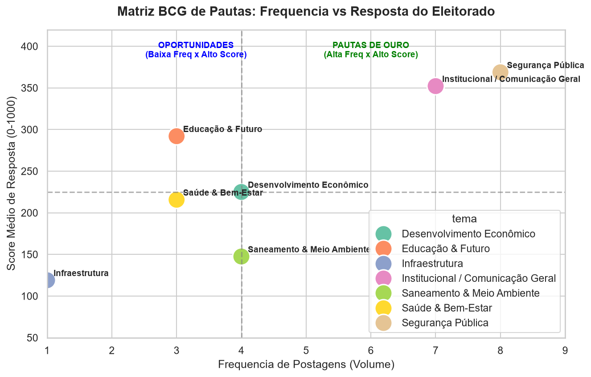
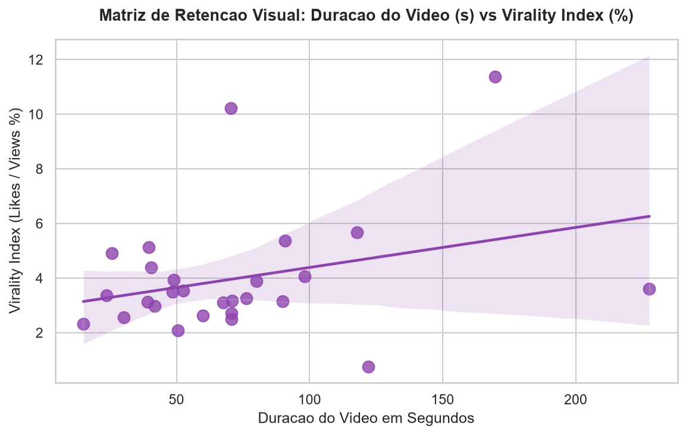
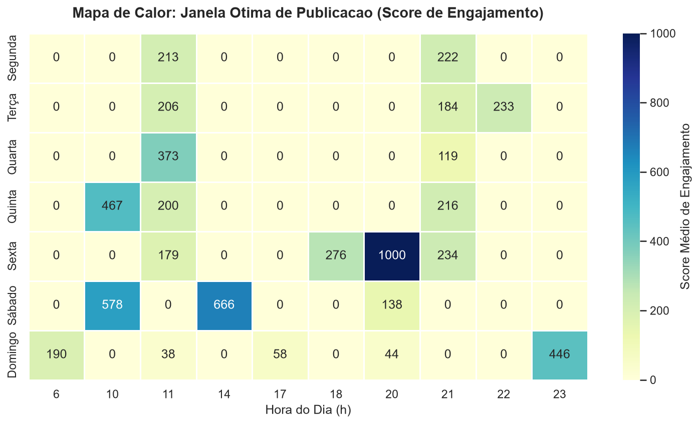
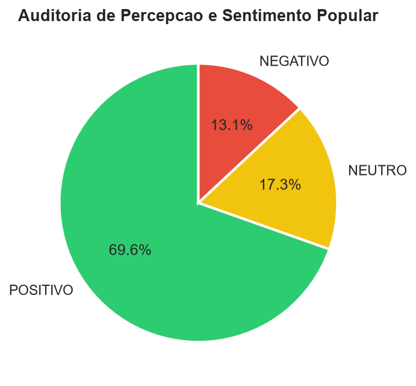
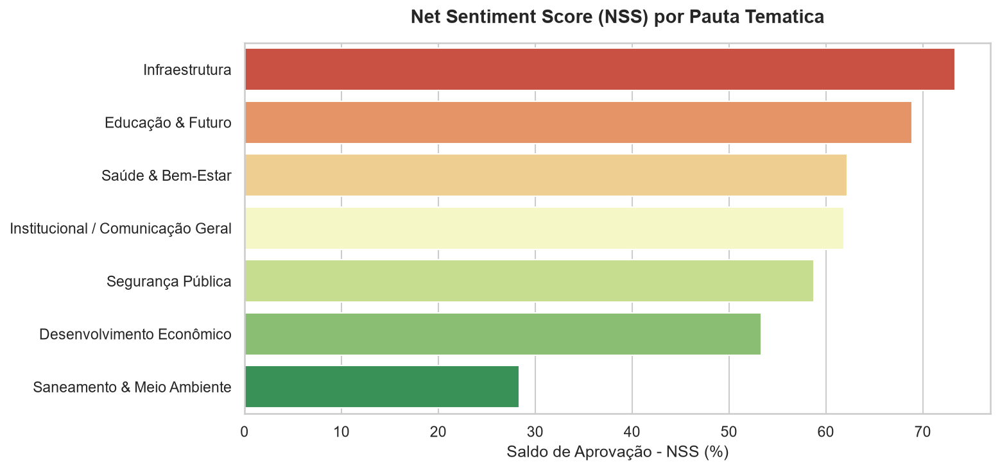
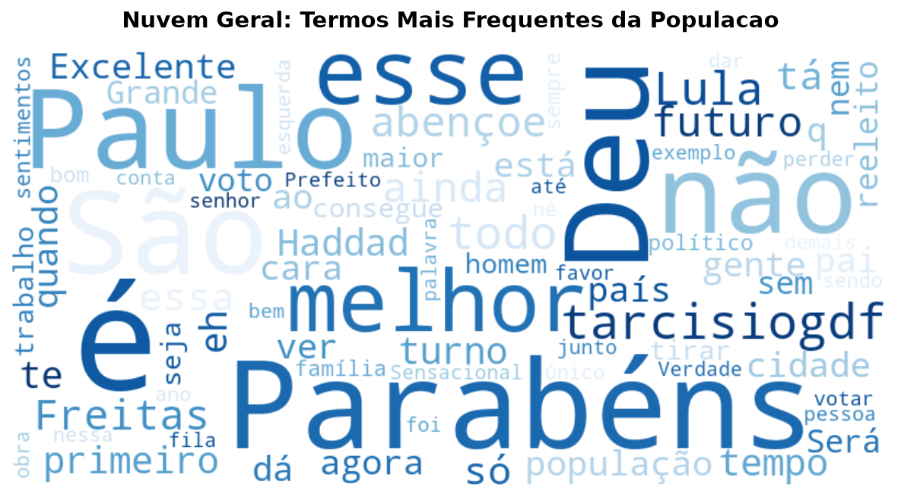
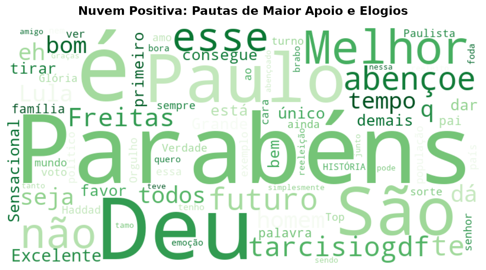
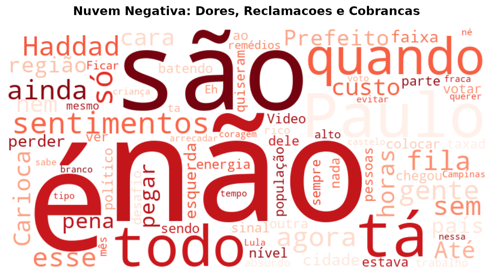
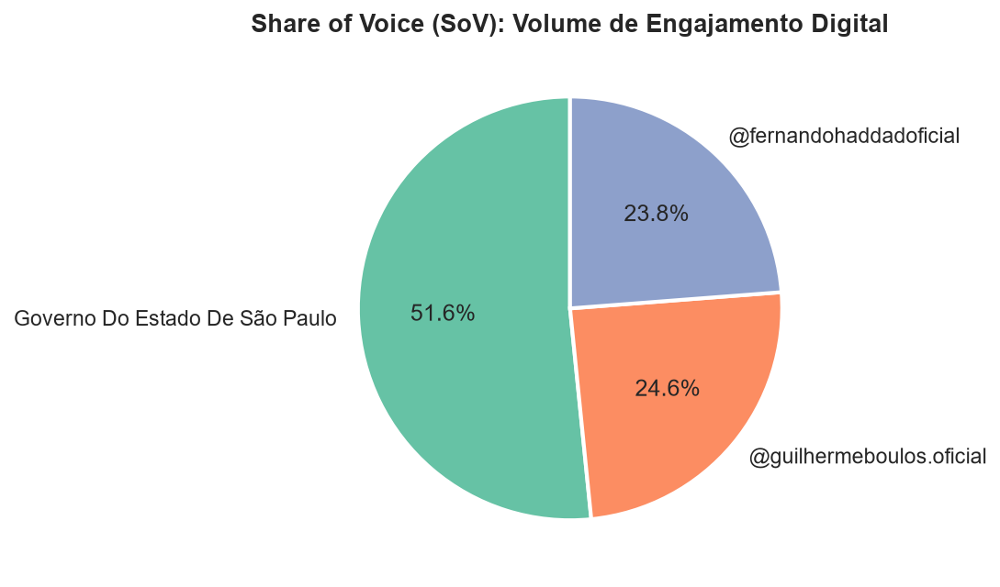
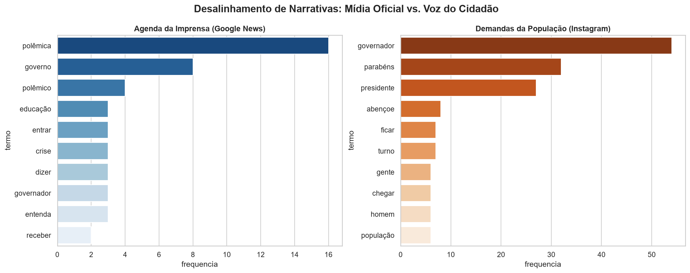

# RELATÓRIO EXECUTIVO DE INTELIGÊNCIA DIGITAL & SENTIMENTO PÚBLICO
**CLIENTE:** GOVERNO DO ESTADO DE SÃO PAULO | **MÓDULO:** AUDITORIA DE REDES SOCIAIS & IMPRENSA

---

## METADADOS DA AUDITORIA TEMPORAL E AMOSTRAGEM
* **Período Total do Estudo:** 09/07/2026 a 26/07/2026 (17 dias auditados)
* **Ponto Focal de Referência (Data de Corte):** 26/07/2026 17:38
* **Amostragem Mapeada:** 30 publicações oficiais do feed/Reels
* **Volume Absoluto de Audiência:** 45,240,306 visualizações auditadas
* **Volume de Interações Diretas:** 2,115,282 ações registradas
* **Total de Comentários Auditados via IA:** 444 comentários processados pelo modelo BERT

---

## GUIA METODOLÓGICO: COMO LER ESTES INDICADORES

Esta auditoria utiliza métricas avançadas de Data Science para transformar dados brutos de redes sociais em decisões estratégicas de comunicação pública:

1. **Score Ponderado de Engajamento (0 a 1000):** Indicador central do estudo. Aplica peso **10x superior** ao comentário devido ao esforço ativo do usuário:
   $$\text{Raw Score} = \text{Curtidas} + (\text{Comentários} \times 10)$$
2. **Virality Index (Taxa de Retenção do Reels):** Calculado por $(\text{Curtidas} / \text{Visualizações}) \times 100$. Indica a capacidade do vídeo de converter espectadores em apoiadores.
3. **Net Sentiment Score (NSS):** Saldo líquido da reputação digital:
   $$\text{NSS} = \frac{\text{Comentários Positivos} - \text{Comentários Negativos}}{\text{Total de Comentários Auditados}} \times 100$$
4. **Controversy Score (Índice de Controvérsia):** Mede o grau de atrito de uma pauta. Calculado por $\frac{\text{Críticas}}{\text{Elogios} + 1}$. Valores acima de **1.0** sinalizam pautas que dividem a opinião pública.
5. **Pareto 80/20 (Concentração de Impacto):** Percentual do engajamento total vindo dos **top 20%** de posts mais performáticos. Quanto maior, mais dependente a estratégia está de poucos conteúdos de alto impacto.
6. **Indicadores de Crescimento Temporal:** Comparações quinzenais e mensais (MoM) para avaliar aceleração ou retração do engajamento digital.
7. **Nuvens de Palavras e Matriz Semântica:** Extração de termos mais frequentes para identificar pautas emergentes, dores da população e oportunidades de comunicação.
8. **Matriz BCG de Pautas:** Classificação de temas em quadrantes estratégicos com base na frequência de postagem e score médio de engajamento.
9. **Análise de Lag & Ressonância:** Avalia o tempo de resposta da população às pautas da imprensa, medindo a influência da mídia tradicional sobre a reação digital.
10. **Share of Voice (SoV):** Projeção de competitividade digital, estimando a participação relativa do cliente frente à oposição e demais atores políticos. A fórmula básica para mensurar o Share of Voice é:
    $$\text{Share of Voice (\%)} = \left( \frac{\text{Número de Menções da Sua Marca}}{\text{Total de Menções do Mercado (Sua Marca + Concorrentes)}} \right) \times 100$$
11. **Indicadores de Polarização e NPS Político:** Avaliam a militância digital, identificando apoiadores ativos, neutros e opositores, permitindo ajustes estratégicos na comunicação.
12. **Janela Ótima de Publicação:** Identificação do dia e horário com maior taxa de resposta do algoritmo, permitindo otimização da agenda de postagens.
13. **Limitações do Estudo:** A análise é baseada em dados públicos e amostras auditadas. Resultados podem variar conforme mudanças no algoritmo das plataformas, sazonalidade e eventos externos.
---

## 1. PANORAMA EXECUTIVO & COMPARAÇÃO TEMPORAL (KPIS CONSOLIDADOS)

### Visão Geral do Período Histórico Acumulado (17 dias auditados)
* **Volume Total de Publicações:** **30 posts**
* **Frequência Média de Postagem:** **1.8 posts/dia**
* **Volume Total de Curtidas:** **2,042,070**
* **Volume Total de Comentários:** **73,212**
* **Alcance Bruto em Vídeo:** **45,240,306 reproduções**
* **Score de Engajamento Acumulado Total:** **2,774,190 pts**
* **Concentração de Impacto (Pareto 80/20):** **46.6%** *(engajamento vindo dos top 20% melhores posts)*

### Comparativo da Última Quinzena (Últimos 15 Dias)
* **Total de Publicações (15d):** **25 posts**
* **Volume de Curtidas (15d):** **1,501,957**
* **Volume de Comentários (15d):** **56,630**
* **Visualizações de Vídeo (15d):** **32,068,555**
* **Score Quinzenal Acumulado:** **2,068,257 pts** *(vs 705,933 pts da quinzena anterior)*
* **Crescimento Quinzenal:** **+193.0%** *(aceleração nos últimos 15 dias)* [Crescimento Acelerado]

### Crescimento de Médio Prazo (Month-over-Month - 30d)
* **Score Mensal Atual (Últimos 30d):** **2,774,190 pts**
* **Score Mensal Anterior (30d Anteriores):** **0 pts**
* **Growth Month-over-Month (MoM):** **+0.0%** *(variação percentual de crescimento mensal)* [Estavel]

---

## 2. MATRIZ BCG DE PAUTAS POLÍTICAS & RETENÇÃO DE VÍDEO

Análise combinada de volume de postagens vs. aprovação popular do tema:

---

## 3. ANÁLISE TEMPORAL E JANELA ÓTIMA DE PUBLICAÇÃO

* **Dia de Ouro:** **Sexta** *(dia com maior taxa de resposta do algoritmo)*
* **Horário de Ouro:** **20:00h** *(janela de pico de engajamento popular)*

---

## 4. ANÁLISE QUALITATIVA DE SENTIMENTO, POLARIZAÇÃO E NPS (IA / BERT)

### 📊 NPS Político & Polarização
* 🟢 **Promotores (Apoiadores Ativos):** **69.6%** (309 comentários)
* 🟡 **Passivos (Neutros):** **17.3%** (77 comentários)
* 🔴 **Detratores (Oposição Ativa):** **13.1%** (58 comentários)
* **Score de NPS:** **56.5**

* 🛡️ **Net Sentiment Score (NSS):** **+56.5%**
* ⚡ **Controversy Score (Taxa de Polarização):** **0.19** *(Valores > 1.0 indicam pautas sensíveis/atrito)*

### 🎯 Sentimento por Pauta Temática (NSS Isolado)

### 👥 Mapeamento de Usuários Super-Engajados (Militância / Base Ativa)
| Usuário | Qtd. Comentários Deixados no Período |
|:---|:---|
| @las.luciane | **8 comentários** |
| @canisio_eidelwein | **6 comentários** |
| @adrianamachado.gja | **5 comentários** |
| @maiaracavalaro | **4 comentários** |
| @crisarcangeli | **3 comentários** |

### ☁️ ANÁLISE SEMÂNTICA EM TRÊS NÍVEIS
#### 1. Nuvem Geral da População
Visão holística de todos os termos com maior repetição nos comentários:

#### 2. Nuvem Positiva (Pontos Fortes & Validação)
Termos associados a elogios, apoio político e reconhecimento das ações de governo:

#### 3. Nuvem Negativa (Matriz de Riscos)
Isolamento das dores da população e pautas sensíveis:

---

## 5. COMPETITIVIDADE DIGITAL: SHARE OF VOICE

O Share of Voice (SoV), ou participação de voz, é uma métrica estratégica de marketing e 
inteligência de mercado que mede a visibilidade e a fatia de conversação que uma marca, 
produto ou figura pública possui no mercado em comparação direta com os seus concorrentes.

---

## 6. DESALINHAMENTO DE NARRATIVAS (IMPRENSA vs. REDES)

Comparativo entre os temas mais pautados pela mídia oficial e as reais cobranças da população:

---

## 7. AUDITORIA DE CONTEÚDO: DESTAQUES x ALERTAS

### 🔥 TOP 3 PUBLICAÇÕES DE MAIOR IMPACTO (BEST PRACTICES)
| Post Shortcode | Pauta Temática | Formato | Curtidas | Comentários | Score |
|:---|:---|:---|:---|:---|:---|
| [DaoF32rx1Jw](https://www.instagram.com/p/DaoF32rx1Jw/) | Segurança Pública | Video | 267,005 | 5,700 | **1000** |
| [DbN_OVxRUs9](https://www.instagram.com/p/DbN_OVxRUs9/) | Institucional / Comunicação Geral | Video | 227,155 | 9,243 | **986** |
| [Da7oYXKx44P](https://www.instagram.com/p/Da7oYXKx44P/) | Segurança Pública | Video | 145,550 | 4,178 | **578** |

### ⚠️ BOTTOM 3 PUBLICAÇÕES DE MENOR RESSONÂNCIA (PONTOS DE ATENÇÃO)
| Post Shortcode | Pauta Temática | Formato | Curtidas | Comentários | Score |
|:---|:---|:---|:---|:---|:---|
| [DasPImoR6I-](https://www.instagram.com/p/DasPImoR6I-/) | Segurança Pública | Video | 8,063 | 425 | **38** |
| [DatP0fZxZiM](https://www.instagram.com/p/DatP0fZxZiM/) | Desenvolvimento Econômico | Video | 11,683 | 268 | **44** |
| [DbQ8W4pxZyN](https://www.instagram.com/p/DbQ8W4pxZyN/) | Saneamento & Meio Ambiente | Video | 13,823 | 520 | **58** |

---

## 📞 8. PRÓXIMOS PASSOS & CALL TO ACTION

> **Transforme dados em votos e aprovação popular contínua.**
> Este relatório é uma amostra da inteligência de dados aplicada à comunicação política. 
> 
> **Agende uma reunião estratégica** conosco para detalharmos o plano de ação de 30 dias com base nestes indicadores e descobrirmos como a Gestão Pública do seu mandato pode escalar com nossos **pacotes complementares de IA, Previsão de Risco e Gestão de Crise 24/7**.

---
*Relatório de Inteligência Digital e Sentimento Popular gerado automaticamente via pipeline Python de alta precisão.*
